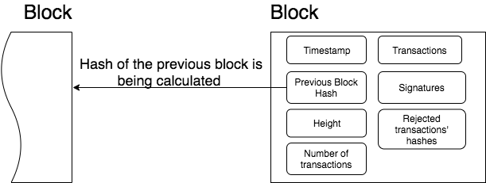

# iroha-demo

## Overview of Iroha

Hyperledger Iroha is a general purpose permissioned blockchain system that can be used to manage digital assets, identity, and serialized data. This can be useful for applications such as interbank settlement, central bank digital currencies, payment systems, national IDs, and logistics, among others.

## Key features of Iroha
- Simple deployment and maintenance
- Variety of libraries for developers
- Role-based access control
- Modular design, driven by command–query separation principle
- Assets and identity management

## How is it different from Bitcoin or Ethereum?
Bitcoin and Ethereum are designed to be permissionless ledgers where anyone can join and access all the data.

Iroha system interaction is permissioned, meaning that only people with requisite access can interact with the system. Hence, access to all the data can be controlled.

One major difference from Ethereum, in particular, is that Hyperledger Iroha allows users to perform common functions, such as creating and transferring digital assets, by using prebuilt commands that are in the system.

## Iroha terminology

### Account

An Iroha entity that is able to perform specified set of actions. Each account belongs to one of existing domains. An account has some number of roles (can be null).

### Asset

Any countable commodity or value. Each asset is related to one of existing domains. For example, an asset can represent any kind of such units - currency unit, a bar of gold, real estate unit, etc.

### Block

Transaction data is permanently recorded in files called blocks. Blocks are organized into a linear sequence over time (also known as the block chain).

Blocks are signed with the cryptographic signatures of Iroha peers, voting for this block during consensus. Signable content is called payload, so the structure of a block looks like this:

`Outside payload`

- signatures — signatures of peers, which voted for the block during consensus round

`Inside payload`

- height — a number of blocks in the chain up to the block
- timestamp — Unix time (in milliseconds) of block forming by a peer
- array of transactions, which successfully passed validation and consensus step
- hash of a previous block in the chain
- rejected transactions hashes — array of transaction hashes, which did not pass stateful validation step; this field is optional